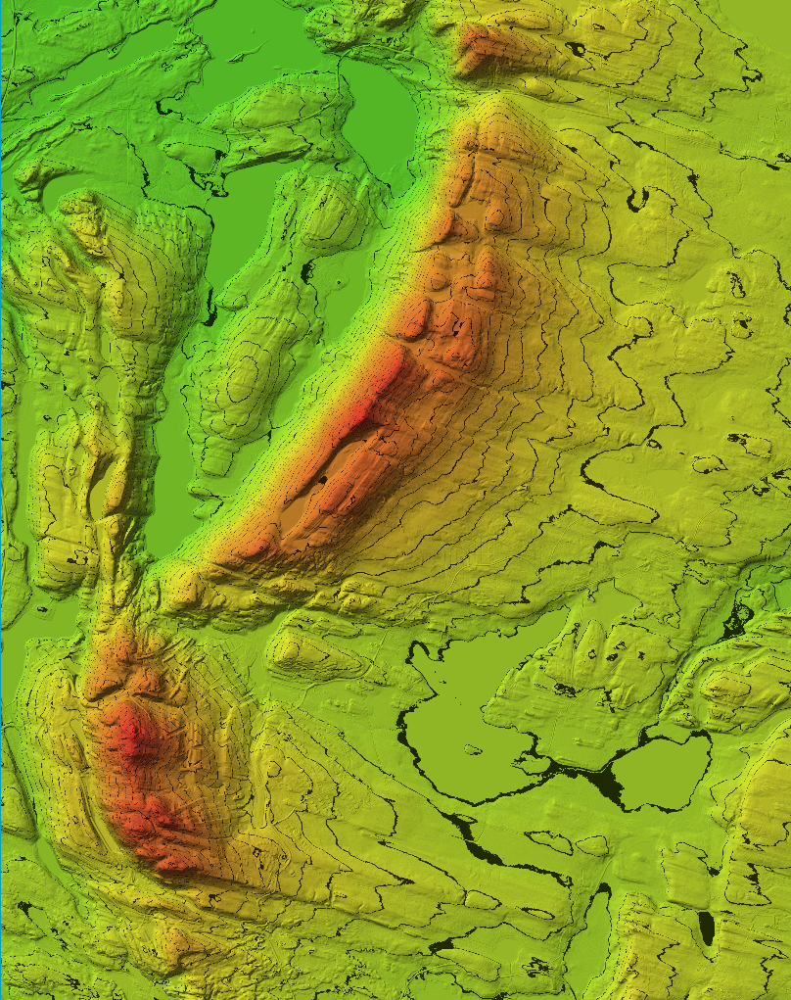

# Ski Touring Pathfinder

Projektin ideana on maanmittauslaitoksen korkeusmallin pohjalta luoda 3d-visualisaatio jostain alueesta.
Tulen itse käyttämään kahta päällekkäistä gridiä, jotka sijaitsevat Rukatunturi-Valtavaara-Konttainen alueella.
Käyttäjä voi valita kaksi haluamaansa pistettä joiden välille lasketaan optimaalinen skinnausreitti.

Tulen tähän tiedostoon dokumentoimaan kaikki lähteet joita käytän työn tekemisessä.
Tavoitteenani on tehdä työ täysin tekoälyä käyttämättä, koska olen jo pidemmän aikaa halunnut oppia OpenGL:n käyttämisen kunnolla.

### Käytetty aika

Seuraan projektiin käyttämääni aktiivista koodausaikaa ystävieni tekemällä [testaustime](https://testaustime.fi) palvelulla.
Tilastot ajan käytöstä voi pyytää minulta esim. discordissa (@faittt). Pyrin osittan myös tällä vähentämään epäilyjä tekoälyn käyttämisestä koodin generointiin,
koska ymmärrän, että aihe on vähintäänkin kunninanhimoinen ensimmäisen vuoden opiskelijalle.

Testaustime on [avointa lähdekoodia](https://github.com/Testaustime) eli datan keräyksen logiikan voi halutessaan tarkistaa.

### Korkeusmalli (2m)

Aineistot on hankittu maanmittauslaitoksen tiedostopalvelusta.

### 2D-kuva alueesta

Ennen projektin aloittamista tein nopean POC-ohjelman JavaFX:llä, jossa piirsin korkeuskartan
maanmittauslaitoksen datasta ja yhdistin sen päälle rinnevarjosteen. Tämä lähinnä sen takia, että näkisin
onko data riittävän tarkkaa (2m mittausväli) muodostamaan tarpeeksi selkeän kuvan alueesta.

### Lähteet

https://asiointi.maanmittauslaitos.fi/karttapaikka/tiedostopalvelu/  
https://www.javier8a.com/itc/bd1/articulo.pdf  
https://javadoc.lwjgl.org/index.html  
https://en.wikipedia.org/wiki/SOLID  
https://docs.gl/  
https://www.glfw.org/docs/3.3/window_guide.html  
https://www.youtube.com/watch?v=DsMohErqXzg  
https://www.youtube.com/watch?v=xoqESu9iOUE  
https://www.theseus.fi/bitstream/handle/10024/505164/Procedural%20terrain%20generation%20plane%20and%20spherical%20surfaces.pdf?sequence=2&isAllowed=y  
https://docs.oracle.com/javase/tutorial/essential/exceptions/tryResourceClose.html  
https://www.datacamp.com/tutorial/a-star-algorithm  
https://learnopengl.com/Getting-started/Shaders  
https://www.youtube.com/watch?v=q5jOLztcvsM  
https://learnopengl.com/Getting-started/Camera  
https://pro.arcgis.com/en/pro-app/latest/tool-reference/spatial-analyst/how-slope-works.htm  
https://www.researchgate.net/publication283787554_Method_for_Measuring_the_Information_Content_of_Terrain_from_Digital_Elevation_Models (3.2.1)  
https://www.cs.cornell.edu/courses/cs3410/2024fa/notes/bitpack.html  
https://minecraft.wiki/w/Java_Edition_protocol/Data_types  
https://github.com/SilverTiger/lwjgl3-tutorial/wiki/Input  
https://antongerdelan.net/opengl/raycasting.html  
https://en.wikipedia.org/wiki/Bilinear_interpolation  
https://www.scratchapixel.com/lessons/mathematics-physics-for-computer-graphics/interpolation/bilinear-filtering.html  
https://learnopengl.com/Getting-started/Textures  
https://github.com/mattdesl/lwjgl-basics/wiki/textures  
https://github.com/ocornut/imgui/wiki  
https://muntercalculation.com/  
https://www.youtube.com/watch?v=bwq_y0zxpQM  
https://en.wikipedia.org/wiki/Fresnel_equations  
https://www.rastertek.com/gl4linuxtut10.html  
https://allurereport.org/docs/  
https://learnopengl.com/Advanced-Lighting/Gamma-Correction
